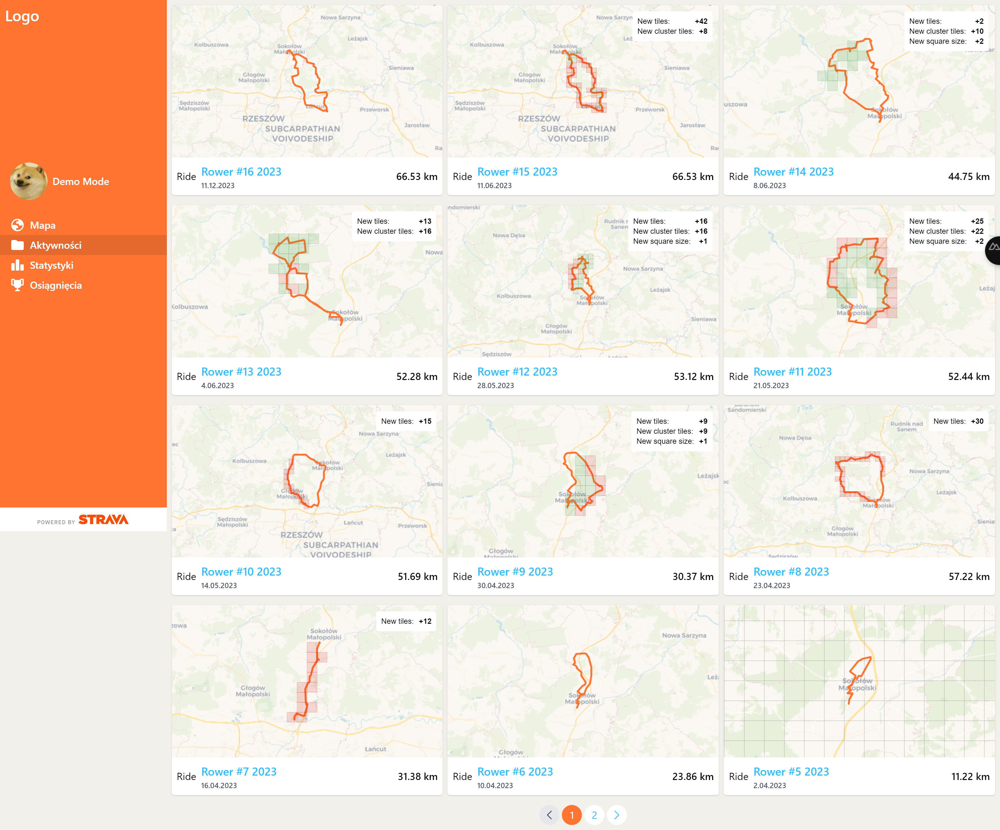
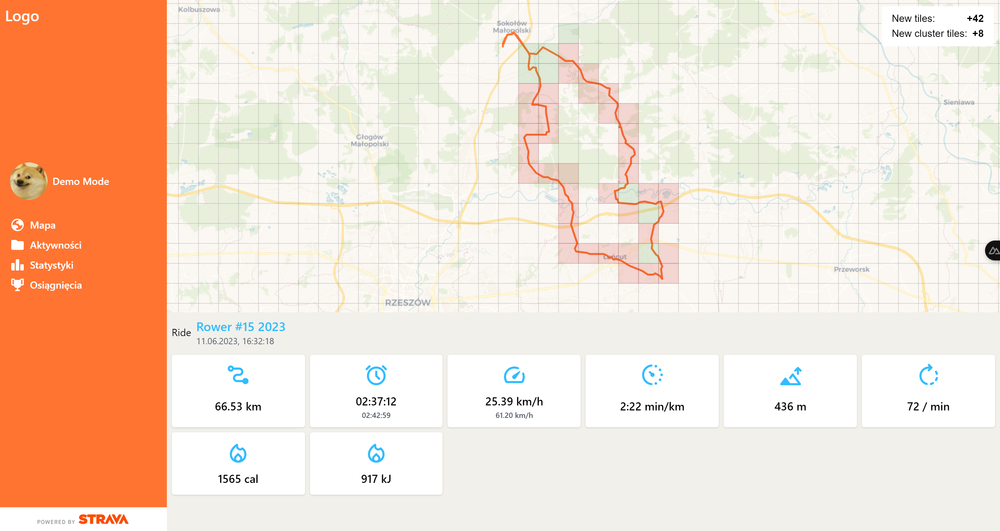

# Strava data visualizer - front-end

Application imlementing [back-end](https://github.com/TomasiakM/StravaApp) features. It is made in Nuxt 3 combined with Pinia, TailwindCSS and Leaflet packages.

## Table of context

- [Technologies](#technologies)
- [Pages](#pages)
- [Setup](#setup)
- [TODO](#todo)

## Technologies

Project is created with:

- [Nuxt 3](https://nuxt.com/docs/getting-started/installation)
- [Tailwind CSS](https://tailwindcss.com/docs/installation)
- [Pinia](https://pinia.vuejs.org/introduction.html)
- [Vue Leafleat](https://github.com/vue-leaflet/vue-leaflet)

## Pages

### Login page

To use application, first user must authorize this app via Strava. To achieve this click "Connect with Strava" button, login into Strava account and authorize this app with all mentioned permissions.


### Home page

The home page displays a map with all activities tracks, unlocked tiles (red - unlocked tile, green - unlocked tile which is a cluster), and biggest square possible to create from unlocked tiles. User can select track, when this happened track change color to blue and popup will appear with basic information about it.


### Activities page

Activities page contains a paged list of activities. Listed items contains basic informations about specific activity and unlocked new tiles, clsters and square via this activity (red - new tile, green - new cluster, also it can be new tile).



### Activity page

This page shows detailed information about a specific activity with new unlocked tiles, clusters and squares.



## Setup

App require .env file with following variables:

```shell
NUXT_PUBLIC_STRAVA_CLIENT_ID=YOUR_STRAVA_CLIENT_ID
NUXT_PUBLIC_BASE_URL=http://localhost:3000
NUXT_PUBLIC_BASE_API_URL=http://localhost:5000
```

Make sure to install the dependencies:

```bash
# npm
npm install
# pnpm
pnpm install
# yarn
yarn install
# bun
bun install
```

Start the development server on <http://localhost:3000>:

```bash
# npm
npm run dev
# pnpm
pnpm run dev
# yarn
yarn dev
# bun
bun run dev
```

## TODO

List of things to-do in future:

- Add demo mode
- Add statistics page
- Add activity types icons
- Add support for activities without gpx track
